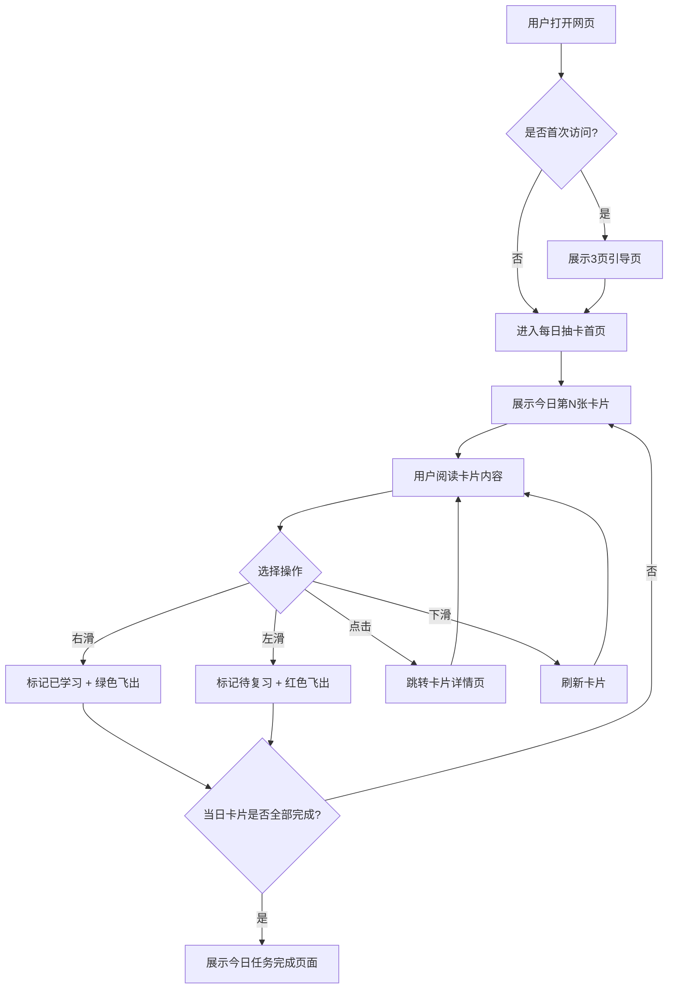
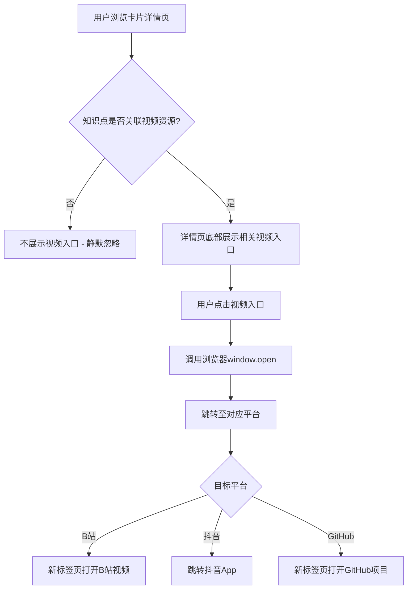
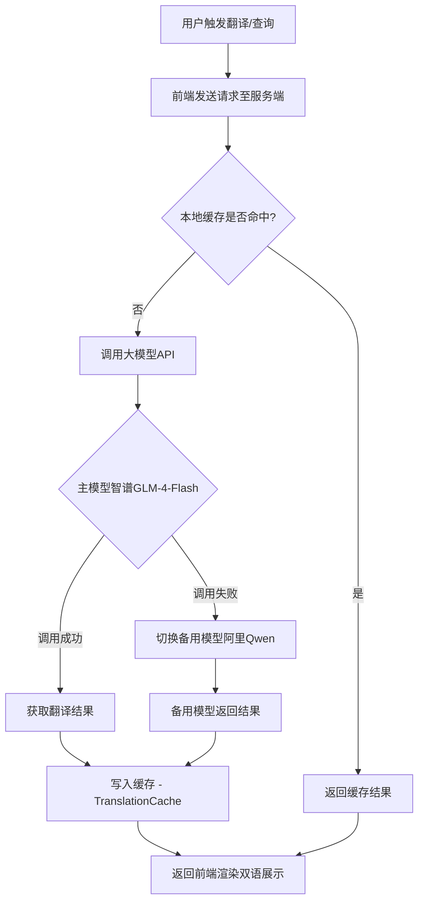

*Product Requirements Document*

# AI大模型学习卡片

AI大模型学习卡片产品需求文档 v2.1 -- 面向AI从业者的碎片化知识记忆工具，通过每日抽卡与滑动交互，帮助用户系统掌握大模型核心概念。

**文档版本** v2.1 | **创建日期** 2026-07-07 | **更新日期** 2026-08-03 | **产品阶段** MVP + 二期规划 | **平台** 一期：单机版自适应离线网页（PWA）；二期：微信小程序 | **GitHub** https://github.com/GriffithLYC/AI-Flash-1K

> **二期升级说明**：v2.0在v1.0基础上全面升级，新增二期规划章节（第6、10、11章），拆分一期/二期功能清单，新增核心流程架构、功能脑图、功能清单总表、可行性分析、大模型API选型等6个章节，总章节数由7章扩展为13章。二期核心目标为接入大模型能力，实现知识点自动更新、视频资源匹配、智能翻译等功能。

### 目录

- [1. 需求背景](#1-需求背景)
- [2. 目标用户与场景](#2-目标用户与场景)
- [3. 核心流程架构](#3-核心流程架构)
- [4. 功能脑图](#4-功能脑图)
- [5. 功能需求（一期）](#5-功能需求一期)
- [6. 功能需求（二期）](#6-功能需求二期)
- [7. 功能清单总表](#7-功能清单总表)
- [8. 数据模型](#8-数据模型)
- [9. 数据指标](#9-数据指标)
- [10. 二期可行性分析报告](#10-二期可行性分析报告)
- [11. 大模型API选型方案](#11-大模型api选型方案)
- [12. 项目规划Roadmap](#12-项目规划roadmap)
- [13. 词库附录与扩容规划](#13-词库附录与扩容规划)

## 1. 需求背景

AI大模型技术以极快的速度迭代，新概念、新论文、新术语几乎每天都在涌现。对于AI从业者、技术转型者以及在校学生来说，建立一个扎实且系统的概念基础变得越来越困难。

当前市面上的学习工具普遍存在几个问题：

- **知识分散**：概念散落在论文、博客、视频里，缺乏系统梳理
- **语言门槛**：英文术语频繁出现但缺少通俗的双语对照解释
- **缺乏反馈**：传统阅读是单向输入，用户不知道自己真正记住了多少
- **场景不匹配**：桌面端学习工具无法利用通勤、排队等碎片时间；现有移动端小程序又不支持桌面端深度学习场景。本产品作为单机版离线网页（PWA），桌面端和移动端均可使用

> **产品定位**：一款单机版离线网页形态（PWA）的AI大模型概念记忆工具。核心机制是"每日抽卡 + 左滑不记得 / 右滑记得"，让学习像刷短视频一样轻松，同时通过重复出现机制确保薄弱概念得到强化。

### 1.1 一期/二期升级策略

本产品采用分阶段建设策略，确保每个阶段交付可用、有价值的产品：

| 维度 | 一期 | 二期 |
|------|------|------|
| 平台 | 单机版离线网页(PWA) | 微信小程序 |
| 产品定位 | 轻量化学习工具 | 智能化学习平台 |
| 大模型能力 | 无（本身不具备大模型能力） | 接入大模型（智谱GLM-4-Flash / 阿里Qwen） |
| API配置 | 不需要 | 平台统一配置，用户无需自行更换API和模型 |
| 知识点来源 | 人工编辑（100-1000词） | 人工 + 大模型自动生成（至2000词） |
| 翻译功能 | 无（预置双语内容） | 大模型实时翻译/优化 |
| 视频资源 | 无 | 自动匹配B站/抖音/GitHub |
| 网络依赖 | 弱依赖（离线可用） | 部分功能需联网 |
| 成本 | 0（纯本地） | 0（采用国内免费开源模型，免费调用无需考虑Token数量） |

**核心原则**：一期定位为轻量化学习工具，本身不具备大模型能力；二期接入大模型能力，用户无需自行更换API和模型，由平台统一推荐；前期采用国内免费开源模型，免费调用无需考虑Token数量。

## 2. 目标用户与场景

### 2.1 用户画像

| 用户类型 | 描述 | 核心痛点 | 使用频率 |
|---|---|---|---|
| AI转型开发者 | 有编程基础，正在转向AI领域的工程师 | 术语众多，概念边界模糊，面试前突击 | 中频（每周3-5次） |
| 在校研究生 | 计算机/AI相关专业学生 | 论文阅读中遇到大量生僻术语，需要快速建立知识图谱 | 高频（每日1-2次） |
| 产品经理 | 负责AI产品或非技术背景想了解AI的人 | 与算法团队沟通时听不懂技术术语 | 低频（每周1-2次） |
| 技术爱好者 | 对AI感兴趣，保持技术敏感度的普通用户 | 想系统了解AI但不知从何入手 | 中频（每周2-3次） |

### 2.2 核心场景

**场景一：晨间通勤（高频）** -- 用户在地铁上打开应用，每日抽卡推送3-5个新概念，快速浏览英文术语、中文解释和应用案例。遇到熟悉的右滑标记"已学习"，不熟悉的左滑标记"待复习"。

**场景二：面试前突击（中频）** -- 用户进入"待复习"列表，集中回顾所有左滑过的概念。系统根据遗忘曲线在合适的时间重新推送这些卡片。

**场景三：主动探索（中频）** -- 用户在词库页按分类浏览全部关键词，搜索特定概念，查看详细解释和案例。

**场景四：视频学习延伸（二期，中频）** -- 用户在学习某个知识点（如Transformer）后，希望深入了解其实际应用。在卡片详情页底部发现"相关视频"入口，点击后跳转至B站/抖音的讲解视频或GitHub开源项目，实现从概念认知到实践理解的延伸学习。

**场景五：双语翻译对照（二期，低频）** -- 用户在阅读英文论文或技术文档时，遇到某个AI术语但不确定其中文翻译或详细含义。通过应用搜索该术语，触发大模型翻译功能，获得高质量的中英双语对照解释，帮助理解论文内容。

## 3. 核心流程架构

本章描述产品的4个核心业务流程，分别覆盖一期的核心交互和二期的扩展能力。

### 3.1 用户线性刷卡片主流程

用户打开网页后，经历引导页（仅首次）、每日抽卡、滑动操作、卡片完成等环节的线性流程。

**流程描述**：

1. 用户打开网页
2. 系统检测是否首次访问：是 -> 展示3页引导页（说明左滑/右滑/点击含义） -> 用户跳过引导
3. 进入每日抽卡首页，展示今日第N张卡片（如"今日进度 2/5"）
4. 用户阅读卡片内容（英文术语、音标、中文解释）
5. 用户选择操作：
   - **右滑**：标记为"已学习"，卡片绿色遮罩飞出，下一张卡片滑入
   - **左滑**：标记为"待复习"，卡片红色遮罩飞出，下一张卡片滑入
   - **点击卡片**：跳转详情页，查看完整解释和案例
   - **下滑**：刷新当前卡片（仅对未标记卡片有效，每日限3次）
6. 重复步骤4-5，直到当日卡片全部完成
7. 展示"今日任务完成"页面，提示明日再来



### 3.2 左右滑动操作流程

描述卡片滑动手势的技术实现逻辑，包括触摸事件处理、阈值判定和动画反馈。

**流程描述**：

1. 手指触碰卡片，触发`touchstart`事件，记录起始位置X0
2. 手指移动，触发`touchmove`事件，实时计算位移`deltaX = currentX - X0`
3. 当`|deltaX| < 60px`时：卡片跟随手指偏移，同时渐变显示方向遮罩（左滑红色/右滑绿色）
4. 当`|deltaX| >= 60px`时：触发阈值判定
5. 手指释放，触发`touchend`事件：
   - `deltaX > 60px`：右滑成功，卡片向右飞出屏幕（-15度角，绿色遮罩，300ms ease-out），下一张从底部滑入（400ms）
   - `deltaX < -60px`：左滑成功，卡片向左飞出屏幕（15度角，红色遮罩，300ms ease-out），下一张从底部滑入（400ms）
   - `|deltaX| < 60px`：未达阈值，卡片以弹簧动画（spring, damping=15, 400ms）复位至中心

```mermaid
flowchart TD
    A[手指触碰卡片] --> B[touchstart: 记录起始位置X0]
    B --> C[touchmove: 计算deltaX]
    C --> D{|deltaX| < 60px?}
    D -->|是| E[卡片跟随手指偏移 + 渐变遮罩]
    E --> C
    D -->|否| F[touchend: 手指释放]
    F --> G{deltaX > 60px?}
    G -->|是| H[右滑成功: 绿色飞出 + 下一张滑入]
    G -->|否| I{deltaX < -60px?}
    I -->|是| J[左滑成功: 红色飞出 + 下一张滑入]
    I -->|否| K[未达阈值: 弹簧动画复位]
```

### 3.3 二期视频跳转流程

用户在卡片详情页发现相关视频资源后，一键跳转至外部平台进行延伸学习。

**流程描述**：

1. 用户在卡片详情页浏览知识点内容
2. 系统检测该知识点是否关联"相关视频"资源
3. 若无关联资源：不展示视频入口（静默忽略）
4. 若有关联资源：详情页底部显示"相关视频"入口（视频缩略图 + 标题 + 平台标识如B站/抖音/GitHub）
5. 用户点击视频入口
6. 调用浏览器window.open，跳转至对应平台（新标签页或外部浏览器）
7. 用户在外部平台观看视频/浏览项目



### 3.4 二期大模型翻译流程

用户触发翻译或查询请求后，系统通过服务端调用大模型API获取结果，并缓存以提高响应速度。

**流程描述**：

1. 用户在网页内触发翻译/查询操作
2. 前端发送请求至服务端（携带术语ID和翻译方向参数）
3. 服务端检查本地缓存是否已有翻译结果
4. 若缓存命中：直接返回缓存结果
5. 若缓存未命中：服务端调用大模型API（智谱GLM-4-Flash为主，阿里百炼Qwen为备用）
6. 大模型返回翻译结果
7. 服务端将结果写入缓存（TranslationCache表）
8. 返回前端，渲染双语对照展示



## 4. 功能脑图

本章以Markdown树形嵌套列表描述产品的全部功能模块，涵盖一期和二期。

```
AI大模型学习卡片
├── 核心学习（一期）
│   ├── 每日抽卡
│   │   ├── 每日5张随机卡片推送
│   │   ├── 左右滑动手势交互
│   │   ├── 滑动动效（绿色/红色遮罩飞出）
│   │   ├── 英文发音播放（TTS + 脉冲动画）
│   │   └── 下滑刷新卡片（每日限3次）
│   ├── 卡片详情
│   │   ├── 术语 + 音标展示
│   │   ├── 双语定义（英文 + 中文）
│   │   ├── 应用案例展示
│   │   ├── 收藏功能
│   │   └── 分享功能（生成卡片图片）
│   ├── 复习系统
│   │   ├── 待复习列表
│   │   ├── 已学习列表
│   │   ├── 遗忘曲线复习算法
│   │   └── 手动调整学习状态
│   └── 词库浏览
│       ├── 分类筛选（10个分类）
│       ├── 难度筛选（入门/进阶/专家）
│       └── 关键词搜索
├── 数据与统计（一期）
│   ├── 学习统计
│   │   ├── 累计学习天数/已掌握词数/待复习词数
│   │   ├── 学习热力图（最近30天）
│   │   ├── 分类掌握度雷达图
│   │   └── 学习趋势折线图（最近7天）
│   └── 埋点数据
│       ├── card_swipe_left（左滑事件）
│       ├── card_swipe_right（右滑事件）
│       ├── card_detail_view（详情查看）
│       ├── daily_draw_complete（完成抽卡）
│       ├── keyword_search（关键词搜索）
│       └── share_card（分享卡片）
├── 个人中心（一期）
│   ├── 每日抽卡数量设置
│   ├── 难度偏好设置
│   ├── 学习提醒时间设置
│   └── 清除学习记录 / 关于与反馈
├── 二期：大模型能力
│   ├── 自动更新知识点
│   │   ├── 大模型定期获取前沿知识点
│   │   └── 人工审核入库
│   ├── 自动匹配视频资源
│   │   ├── B站/抖音/GitHub资源匹配
│   │   ├── 详情页"相关视频"入口
│   │   └── 无资源时静默忽略
│   ├── 知识点翻译
│   │   ├── 中文 -> 英文翻译
│   │   ├── 英文 -> 中文翻译
│   │   └── 翻译结果缓存（一译永存）
│   └── 统一模型管理
│       ├── 平台统一推荐模型配置
│       ├── 主备模型自动切换
│       └── 用户无需自行配置
└── 词库系统
    ├── 100词（一期v1.0，已完成）
    ├── 500词（一期v1.2）
    ├── 1000词（一期v1.3）
    └── 2000词（二期v2.1）
```

## 5. 功能需求（一期）

> 一期定位为轻量化学习工具，本身不具备大模型能力。所有知识内容为人工编辑预置，核心交互为左右滑动手势。

### 5.1 功能总览

| # | 模块 | 功能描述 | 优先级 |
|---|---|---|---|
| 1 | 每日抽卡 | 每日向用户推送5张随机AI关键词卡片，用户通过左右滑动标记掌握状态。左滑"不记得"进入待复习池，右滑"记得"进入已学习池。已学习的卡片短期内不再出现。 | P0 |
| 2 | 卡片详情 | 点击卡片进入详情页，展示英文术语、音标、英文定义、中文定义、应用案例。支持收藏和分享。 | P0 |
| 3 | 发音播放 | 卡片和详情页音标右侧显示小喇叭图标，点击播放术语英文发音。音频为预置TTS合成MP3，播放时图标显示脉冲动画。 | P0 |
| 4 | 待复习 | 汇总所有左滑"不记得"的卡片，支持按分类筛选，支持手动触发重新学习。系统按遗忘曲线算法在每日抽卡中穿插推送。 | P0 |
| 5 | 已学习 | 展示所有右滑"记得"的卡片，支持搜索和分类筛选。用户可随时将已学习卡片移回待复习。 | P0 |
| 6 | 词库浏览 | 展示全部关键词列表，支持按10个分类筛选、按难度筛选、关键词搜索。点击可预览卡片详情。 | P1 |
| 7 | 学习统计 | 展示累计学习天数、已掌握词数、待复习词数、学习热力图、分类掌握度雷达图。 | P1 |
| 8 | 个人中心 | 设置每日抽卡数量、难度偏好、学习提醒时间、清除学习记录、关于与反馈。 | P2 |
| 9 | 收藏夹 | 用户可收藏任意卡片到独立列表，方便快速回顾重点概念。 | P2 |

### 5.2 核心模块详解

#### 5.2.1 每日抽卡页（首页）

**【一期 - 网页首页 -- 每日抽卡】**
界面包含元素：今日学习进度、2 / 5、Transformer、/traens'fo:rmer/、一种神经网络架构，通过注意力机制一次性处理整句文本，是现代大语言模型的基础设计。、<- 不记得、记得 ->、待复习 12、已学习 48
> 注：此为界面原型示意，实际开发以UI设计稿为准。

**业务逻辑**：

- 每日零点重置抽卡计数，从"未学习"和"待复习"池中按算法抽取5张卡片
- 抽卡算法优先级：待复习（按遗忘曲线权重）> 未学习（随机）
- 若用户完成当日5张卡片，显示"今日任务完成"并提示明日再来
- 若词库中所有卡片均处于"已学习"状态，提示用户"已通关全部词库"并引导重新学习

**交互逻辑**：

- **左右滑动**：手指在卡片上水平滑动超过60px时触发状态变更，释放后卡片向对应方向飞出。滑动过程中卡片跟随手指位移，超出屏幕边界后触发下一张卡片从底部滑入。
- **滑动动效**：
  - 左滑（不记得）：卡片向左飞出屏幕，飞出角度约15度，同时显示红色"不记得"遮罩层（透明度从0到0.3渐变）。飞出耗时300ms，缓动曲线ease-out。下一张卡片从底部以translateY(100%)滑入至translateY(0)，耗时400ms。
  - 右滑（记得）：卡片向右飞出屏幕，飞出角度约-15度，同时显示绿色"记得"遮罩层（透明度从0到0.3渐变）。飞出耗时300ms，缓动曲线ease-out。下一张卡片滑入动画与左滑一致。
  - 滑动中但未触发阈值（< 60px）：释放后卡片以弹簧动画（spring, damping=15）复位至中心位置，耗时400ms。
- **发音播放**：音标右侧显示小喇叭图标（同字号，主题色）。点击后调用HTML5 Audio API播放对应术语的英文发音音频。播放期间图标显示脉冲动画（scale 1.0->1.2->1.0，循环）。音频来源：预置TTS合成音频文件（本地缓存），格式MP3，单条音频控制在3秒内。
- **点击卡片**：跳转详情页查看完整解释和案例
- **下滑**：刷新当前卡片（仅对未标记卡片有效，每日限3次）

**边界情况**：

- 网络异常：本地缓存最近抽到的20张卡片，无网络时仍可正常学习
- 卡片耗尽：当日卡片全部完成后，首页显示完成状态并提供"去词库探索"入口
- 新用户首次进入：展示3页引导页，说明左滑/右滑/点击查看的含义

#### 5.2.2 卡片详情页

**【一期 - 卡片详情页】**
界面包含元素：<- 返回、Transformer、模型架构、英文解释、A neural network architecture that processes entire sentences at once using attention mechanisms.、中文解释、一种通过注意力机制一次性处理整句文本的神经网络架构，是现代LLM的基础。、应用案例、Google Translate使用Transformer后翻译质量大幅提升，ChatGPT也基于此架构构建。、收藏、分享
> 注：此为界面原型示意，实际开发以UI设计稿为准。

**业务逻辑**：

- 详情页从首页点击卡片进入，展示该词条的完整信息
- 收藏状态持久化到本地存储，同步到云端（登录用户）
- 分享功能生成带有词条名称和一句话解释的卡片图片，支持保存到本地或分享给好友（使用Web Share API）
- 底部提供"标记为已学习"和"标记为待复习"的快捷按钮

#### 5.2.3 词库浏览页

**业务逻辑**：

- 以网格或列表形式展示全部关键词，每个词条显示术语名称、分类标签、掌握状态（未学习/待复习/已学习）
- 顶部提供分类筛选栏（10个分类标签）和搜索框
- 支持按难度筛选（入门/进阶/专家）
- 点击词条进入详情页
- 列表支持无限滚动加载，每页加载20条

#### 5.2.4 学习统计页

| 指标 | 数值 |
|------|------|
| 连续学习天数 | 12 |
| 已掌握词汇 | 48 |
| 待复习词汇 | 15 |
| 未学习词汇 | 37 |

**业务逻辑**：

- 展示用户的学习数据，包括累计学习天数、已掌握/待复习/未学习的数量
- 学习热力图：以日历形式展示最近30天的学习记录，有学习的天数标记颜色深浅
- 分类掌握度：雷达图展示10个分类中每个分类的掌握比例
- 学习趋势：折线图展示最近7天每日学习卡片数量

## 6. 功能需求（二期）

> 二期接入大模型能力，用户无需自行更换API和模型，由平台统一推荐。前期采用国内免费开源模型，免费调用无需考虑Token数量。

### 6.1 自动更新知识点（P0）

**功能描述**：系统每周通过大模型从学术论文、技术博客、行业报告中自动提取共识性前沿知识点，经人工审核后入库，持续丰富词库内容。这是二期最核心的能力，确保产品内容始终跟进AI领域最新发展。

**业务逻辑**：

1. 每周一凌晨，服务端定时任务触发知识点更新流程
2. 大模型从预置的信息源（arXiv摘要、Hugging Face趋势、技术博客RSS）提取新概念
3. 提取结果包含：英文术语、中文翻译、英文定义、中文定义、应用案例、分类建议、难度建议
4. 系统自动去重（与现有词库比对，相似度阈值 > 0.85判定为重复）
5. 新知识进入"待审核"状态，由运营人员在后台审核确认
6. 审核通过后正式入库，用户下次打开应用时拉取更新

**边界情况**：

- API调用失败：切换备用模型重试，3次失败则本周跳过并告警
- 提取质量不足：设置最低质量阈值，低于阈值的条目直接丢弃
- 词库已满（达到2000词上限）：停止自动新增，仅保留更新已有词条的解释

### 6.2 自动匹配视频资源（P0）

**功能描述**：为每个知识点自动匹配相关的B站/抖音教学视频和GitHub开源项目。匹配成功后，卡片详情页底部展示"相关视频"入口，用户点击可跳转至对应平台进行延伸学习。

**业务逻辑**：

1. 新知识点入库后，触发视频匹配流程
2. 大模型根据知识点术语生成搜索关键词
3. 系统调用各平台API进行搜索：
   - B站：通过关键词搜索API获取相关视频（优先选择播放量 > 1万、时长5-30分钟的教学视频）
   - GitHub：通过GitHub Search API搜索相关开源项目（优先选择Star > 1000的项目）
4. 大模型对搜索结果进行相关性排序，筛选Top 3
5. 匹配结果写入VideoResource表
6. 用户在卡片详情页浏览时，若有关联视频则展示入口；无相关资源时静默忽略，不影响用户体验

**边界情况**：

- 搜索无结果：不展示视频入口，静默忽略（无相关资源时忽略）
- 视频链接失效：每周定期检查链接有效性，失效标记为inactive并重新匹配
- 平台API限流：GitHub Search API限制5000次/小时，通过缓存和批量处理避免超限

### 6.3 知识点翻译/双语展示（P1）

**功能描述**：用户可对任意知识点触发大模型翻译功能，获得高质量的中英双向翻译结果。翻译结果缓存至服务端，一译永存，避免重复调用API。

**业务逻辑**：

1. 用户在卡片详情页点击"AI翻译"按钮
2. 前端发送请求：`{ keyword_id, direction: "cn2en" | "en2cn" }`
3. 服务端先查询TranslationCache表，检查是否已有缓存
4. 缓存命中：直接返回缓存结果，响应时间 < 50ms
5. 缓存未命中：调用大模型API进行翻译
6. 翻译结果写入TranslationCache表（设置TTL为永久）
7. 返回前端，在卡片详情页展示双语对照视图

**边界情况**：

- 大模型API不可用：切换备用模型，两个模型均不可用时提示"翻译服务暂时不可用，请稍后再试"
- 翻译质量不满意：提供"重新翻译"按钮，清除缓存后重新调用API
- 专有名词处理：在Prompt中明确指示大模型保持专有名词英文原文（如Transformer、LoRA等）

### 6.4 统一模型管理（P0 - 基础设施）

**功能描述**：平台统一配置大模型API，支持主备双模型策略。用户无需自行配置任何API Key或模型参数，所有大模型能力对用户完全透明。

**业务逻辑**：

1. 服务端维护统一的模型配置表，包含API地址、模型名称、API Key、优先级、状态等
2. 默认使用智谱GLM-4-Flash作为主力模型（永久免费，128K上下文，30 QPS）
3. 阿里百炼Qwen-Max-Flash作为备用模型（每月100万Token免费续期）
4. 调用逻辑：优先使用主力模型 -> 若调用失败（超时/错误/限流）自动切换备用模型 -> 两个模型均失败则返回降级响应
5. 运营后台支持在线切换模型配置，无需重新发布

**边界情况**：

- 主力模型不可用：自动切换备用模型，记录切换日志
- 两个模型均不可用：返回降级响应（如返回预置翻译或空结果），前端友好提示
- API Key过期：监控告警，运营人员及时更新

## 7. 功能清单总表

本章将一期和二期的全部功能合并为统一表格，共23个功能条目。

| # | 模块 | 功能点 | 阶段 | 优先级 | 状态 |
|---|------|--------|------|--------|------|
| 1 | 每日抽卡 | 每日5张随机卡片推送 | 一期 | P0 | 已完成 |
| 2 | 卡片交互 | 左右滑动手势 + 动效 | 一期 | P0 | 已完成 |
| 3 | 发音播放 | TTS英文发音 + 脉冲动画 | 一期 | P0 | 已完成 |
| 4 | 卡片详情 | 双语定义 + 案例展示 | 一期 | P0 | 已完成 |
| 5 | 待复习 | 列表展示 + 分类筛选 | 一期 | P0 | 已完成 |
| 6 | 已学习 | 列表展示 + 移回待复习 | 一期 | P0 | 已完成 |
| 7 | 词库浏览 | 全部词条 + 分类/难度/搜索 | 一期 | P1 | 已完成 |
| 8 | 学习统计 | 热力图 + 雷达图 + 趋势图 | 一期 | P1 | 规划中 |
| 9 | 收藏夹 | 独立收藏列表 | 一期 | P2 | 规划中 |
| 10 | 个人中心 | 设置 + 提醒 + 清除记录 | 一期 | P2 | 规划中 |
| 11 | 学习提醒 | 定时推送提醒 | 一期 | P1 | 规划中 |
| 12 | 卡片分享 | 生成分享图片 | 一期 | P1 | 规划中 |
| 13 | 词库扩展 | 100 -> 500词 | 一期 | P1 | 规划中 |
| 14 | 词库扩展 | 500 -> 1000词 | 一期 | P1 | 规划中 |
| 15 | 智能复习 | 遗忘曲线复习算法 | 一期 | P1 | 规划中 |
| 16 | 用户登录 | Web账号登录 + 云同步 | 一期 | P1 | 规划中 |
| 17 | 自动更新知识点 | 定期获取前沿知识点 + 审核入库 | 二期 | P0 | 待开发 |
| 18 | 自动匹配视频 | B站/抖音/GitHub资源匹配 | 二期 | P0 | 待开发 |
| 19 | 视频入口 | 详情页"相关视频"跳转 | 二期 | P0 | 待开发 |
| 20 | 知识点翻译 | 中英双向翻译 + 双语展示 | 二期 | P1 | 待开发 |
| 21 | 统一模型管理 | 平台统一API配置 + 主备切换 | 二期 | P0 | 待开发 |
| 22 | 词库扩容 | 扩展至2000词 | 二期 | P1 | 待开发 |
| 23 | 主备模型切换 | 模型故障自动切换 | 二期 | P1 | 待开发 |

## 8. 数据模型

### 8.1 一期核心实体

```
// 关键词词条
Keyword {
  id: string           // 唯一标识
  term: string         // 英文术语（专有名词保持英文原文，如Transformer）
  phonetic: string     // 音标，如 /traens'fo:rmer/
  audio_url: string    // 发音音频文件路径（MP3格式，本地预置）
  en_definition: string   // 英文解释
  cn_definition: string   // 中文解释
  example: string      // 应用案例（双语）
  category: string     // 分类标签
  difficulty: number   // 难度等级 1-3
}

// 用户学习记录
LearningRecord {
  user_id: string
  keyword_id: string
  status: enum        // unlearned / reviewing / learned
  swipe_count: number // 左滑次数（用于计算遗忘权重）
  last_swiped_at: timestamp
  created_at: timestamp
}

// 用户每日抽卡记录
DailyDraw {
  user_id: string
  date: string        // YYYY-MM-DD
  drawn_keywords: array<keyword_id>
  completed: boolean
}

// 用户设置
UserSettings {
  user_id: string
  daily_count: number     // 每日抽卡数量，默认5
  difficulty_filter: array // 难度偏好筛选
  reminder_time: string    // 每日提醒时间，默认09:00
  reminder_enabled: boolean
}
```

### 8.2 二期新增实体

```
// 视频资源关联
VideoResource {
  id: string
  keyword_id: string       // 关联的关键词ID
  platform: enum           // bilibili / douyin / github
  title: string            // 视频标题或项目名称
  url: string               // 外部链接
  thumbnail_url: string    // 缩略图URL
  view_count: number       // 播放量/Star数
  duration: string         // 视频时长（视频类）
  relevance_score: number  // 相关性评分 0-1
  status: enum             // active / inactive / pending_review
  matched_at: timestamp    // 匹配时间
  checked_at: timestamp    // 最后检查时间
}

// 翻译缓存
TranslationCache {
  id: string
  keyword_id: string       // 关联的关键词ID
  direction: enum         // cn2en / en2cn
  source_text: string      // 原文
  translated_text: string  // 翻译结果
  model_used: string       // 使用的模型名称
  created_at: timestamp    // 翻译时间（一译永存，无TTL）
}

// 知识点更新日志
KnowledgeUpdateLog {
  id: string
  batch_id: string         // 批次ID（每周一次）
  total_extracted: number  // 本批次提取总数
  total_approved: number   // 审核通过数
  total_rejected: number   // 审核拒绝数
  model_used: string       // 使用的模型
  status: enum             // pending / processing / completed / failed
  started_at: timestamp
  completed_at: timestamp
}
```

### 8.3 状态流转

> **一期状态流转规则**：
> 未学习（unlearned） --右滑--> 已学习（learned）
> 未学习（unlearned） --左滑--> 待复习（reviewing）
> 待复习（reviewing） --右滑--> 已学习（learned）
> 待复习（reviewing） --左滑--> 待复习（reviewing，swipe_count + 1）
> 已学习（learned） --手动操作--> 待复习（reviewing）

> **二期视频资源状态流转规则**：
> 待审核（pending_review） --审核通过--> 有效（active）
> 待审核（pending_review） --审核拒绝--> 无效（inactive）
> 有效（active） --链接失效检测--> 无效（inactive）
> 无效（inactive） --重新匹配--> 待审核（pending_review）

## 9. 数据指标

### 9.1 一期核心指标

| 指标类型 | 指标名称 | 定义 | 目标值 |
|---|---|---|---|
| 留存 | 7日留存率 | 注册后第7天仍打开应用的用户占比 | > 35% |
| 留存 | 30日留存率 | 注册后第30天仍打开应用的用户占比 | > 15% |
| 活跃 | DAU/MAU | 日活跃占月活跃比例 | > 20% |
| 功能 | 每日抽卡完成率 | 完成当日全部抽卡的用户占比 | > 60% |
| 功能 | 卡片详情点击率 | 点击卡片进入详情的次数 / 总展示次数 | > 30% |
| 内容 | 平均掌握词汇数 | 用户"已学习"状态的平均词条数 | > 50个（30天后） |

### 9.2 二期新增指标

| 指标类型 | 指标名称 | 定义 | 目标值 |
|---|---|---|---|
| 功能 | 视频入口点击率 | 点击"相关视频"入口的用户数 / 展示入口的用户数 | > 15% |
| 功能 | 翻译功能使用率 | 使用AI翻译的用户数 / DAU | > 10% |
| 质量 | 视频匹配有效率 | 匹配到的有效视频数 / 总匹配尝试数 | > 70% |
| 质量 | 翻译缓存命中率 | 缓存命中的翻译请求数 / 总翻译请求数 | > 90% |

### 9.3 一期埋点事件

| 事件名 | 触发时机 | 用途 |
|---|---|---|
| card_swipe_left | 用户左滑标记"不记得" | 分析用户难以掌握的概念分布 |
| card_swipe_right | 用户右滑标记"记得" | 分析用户已掌握的概念分布 |
| card_detail_view | 用户点击卡片进入详情 | 评估卡片封面信息是否足够 |
| daily_draw_complete | 用户完成当日全部抽卡 | 衡量核心功能完成度 |
| keyword_search | 用户在词库页搜索 | 发现用户主动学习的兴趣点 |
| share_card | 用户分享卡片 | 评估社交传播潜力 |

### 9.4 二期新增埋点事件

| 事件名 | 触发时机 | 用途 |
|---|---|---|
| video_entry_click | 用户点击"相关视频"入口 | 评估视频匹配质量和用户兴趣 |
| video_jump_success | 视频跳转成功完成 | 监控跳转成功率 |
| translation_request | 用户触发翻译功能 | 评估翻译功能使用频率 |
| translation_cache_hit | 翻译结果命中缓存 | 监控缓存效率 |

## 10. 二期可行性分析报告

本章从技术、成本、运营、风险四个维度对二期大模型能力的可行性进行评估。

### 10.1 技术可行性

**结论：可行，接入成本低。**

- 智谱GLM-4-Flash已全量免费开放（128K上下文，30 QPS并发），API兼容OpenAI格式，接入仅需修改请求地址和认证方式
- 阿里百炼Qwen系列持续提供每月100万Token免费额度（128K上下文），同样兼容OpenAI格式
- 视频匹配依赖的GitHub Search API免费额度5000次/小时，完全满足2000词的匹配需求
- 浏览器支持通过`window.open`等API实现跳转至外部链接（新标签页或外部浏览器）

### 10.2 成本可行性

**结论：前期100%免费，无需Token费用预算。**

- 预估月消耗约72万Token（翻译40万 + 视频匹配30万 + 知识点更新2万），远低于智谱的免费额度（无上限）和阿里百炼的免费额度（100万Token/月）
- 服务端基础设施：需要搭建轻量级后端服务（Node.js/Python），可部署在免费额度云服务（如腾讯云Serverless / Vercel）
- 唯一的持续成本为人工审核知识点的运营人力（预计每周1-2小时）

### 10.3 运营可行性

**结论：可行，运营成本可控。**

- 知识点更新采用"大模型生成 + 人工审核"机制，审核工作量可控（每周约10-20条新增）
- 视频链接通过定时任务每周检查一次有效性，失效后自动重新匹配
- 翻译功能采用缓存策略，一次翻译永久缓存，重复请求零成本
- 统一模型管理由平台统一运维，用户端零感知

### 10.4 风险与缓解

| 风险 | 影响 | 缓解措施 |
|------|------|----------|
| API政策变更 | 免费额度取消或降级 | 主备双模型策略，分散风险；监控API公告，提前储备替代方案 |
| 生成质量不稳定 | 翻译或知识点质量不达标 | 人工审核 + 结果缓存；翻译提供"重新翻译"按钮 |
| 视频链接失效 | 用户点击后跳转失败 | 每周定期检查 + 自动重新匹配；失效时静默移除入口 |
| 平台限流 | API调用频率超限 | 指数退避重试 + 缓存策略；翻译缓存命中率 > 90% 后实际调用量极低 |

## 11. 大模型API选型方案

### 11.1 主力模型：智谱AI GLM-4-Flash

| 属性 | 说明 |
|------|------|
| 模型名称 | GLM-4-Flash |
| 提供方 | 智谱AI（ZhipuAI） |
| 免费策略 | 永久免费 |
| 上下文长度 | 128K |
| 并发限制 | 30 QPS |
| API格式 | OpenAI兼容格式 |
| 官网 | https://open.bigmodel.cn |

**推荐理由**：永久免费无额度上限，128K上下文足够处理翻译和知识点生成任务，30 QPS并发满足日常请求量，OpenAI兼容格式接入成本低。

### 11.2 备用模型：阿里云百炼 Qwen-Max-Flash

| 属性 | 说明 |
|------|------|
| 模型名称 | Qwen-Max-Flash |
| 提供方 | 阿里云百炼（Bailian） |
| 免费策略 | 每月100万Token免费续期 |
| 上下文长度 | 128K |
| 并发限制 | 按免费额度约束 |
| API格式 | OpenAI兼容格式 |
| 官网 | https://bailian.console.aliyun.com |

**推荐理由**：每月100万Token免费额度可持续续期，Qwen系列中文能力强，适合处理中文相关的翻译和知识提取任务，作为智谱的备份模型提供双重保障。

### 11.3 选型理由

1. **双模型互为备份**：一个不可用时自动切换，确保服务稳定性
2. **成本极低**：月消耗约72万Token完全在免费额度内，前期零成本
3. **用户无感知**：平台统一管理API配置，用户无需自行配置任何API Key
4. **接入标准统一**：两个API均兼容OpenAI格式，代码层面仅需切换base_url和api_key

### 11.4 API调用架构

```
网页前端（HTML5 + CSS3 + JavaScript + Service Worker + localStorage）
    |
    | HTTPS请求
    v
服务端（Node.js/Python）
    |
    | 1. 检查缓存
    | 2. 缓存命中 -> 返回缓存结果
    | 3. 缓存未命中 -> 调用大模型API
    v
统一模型管理模块
    |
    | 默认使用主力模型
    v
智谱GLM-4-Flash API（主力）
    |
    | 调用失败时自动切换
    v
阿里百炼Qwen-Max-Flash API（备用）
    |
    | 两个模型均失败
    v
降级响应（返回预置内容或友好提示）
```

### 11.5 接口设计

**翻译接口**：

```
POST /api/v1/translate
Request:
{
  "keyword_id": "kw_001",
  "direction": "cn2en" | "en2cn"
}

Response:
{
  "code": 0,
  "data": {
    "keyword_id": "kw_001",
    "source_text": "...",
    "translated_text": "...",
    "model_used": "glm-4-flash",
    "from_cache": false
  }
}
```

**知识点更新接口（内部定时任务）**：

```
POST /api/v1/admin/knowledge/update
Request:
{
  "trigger": "scheduled" | "manual",
  "sources": ["arxiv", "huggingface", "blogs"]
}

Response:
{
  "code": 0,
  "data": {
    "batch_id": "batch_20260708",
    "total_extracted": 15,
    "status": "pending"
  }
}
```

**视频匹配接口（内部定时任务）**：

```
POST /api/v1/admin/video/match
Request:
{
  "keyword_ids": ["kw_001", "kw_002"],
  "platforms": ["bilibili", "github"]
}

Response:
{
  "code": 0,
  "data": {
    "matched": 2,
    "failed": 0,
    "results": [...]
  }
}
```

### 11.6 Token消耗估算

| 功能 | 单次消耗 | 频率 | 月消耗 |
|------|----------|------|--------|
| 知识点翻译（单条） | ~200 Token | 2000条（一次性，缓存后不再消耗） | ~40万Token |
| 视频匹配（单条） | ~150 Token | 2000条（一次性，缓存后不再消耗） | ~30万Token |
| 知识点更新（批量） | ~5000 Token/次 | 4次/月（每周1次） | ~2万Token |
| **月总计** | - | - | **~72万Token** |

**结论**：月消耗约72万Token，远低于智谱GLM-4-Flash的免费额度（无上限）和阿里百炼的免费额度（100万Token/月），前期100%免费，成本风险极低。

## 12. 项目规划Roadmap

### 一期：轻量化学习工具（无大模型能力）

| 版本 | 核心内容 | 状态 |
|------|----------|------|
| v1.0 MVP | 每日抽卡、滑动交互、卡片详情、待复习/已学习、词库浏览、100词 | 已完成 |
| v1.1 | 学习统计（热力图、雷达图、趋势图）、收藏夹、学习提醒推送 | 规划中 |
| v1.2 | 词库扩展至500词、难度筛选优化、卡片分享（生成图片） | 规划中 |
| v1.3 | 词库扩展至1000词、Web账号登录 + 云同步、智能复习算法（遗忘曲线） | 规划中 |

### 二期：接入大模型能力

| 版本 | 核心内容 | 状态 |
|------|----------|------|
| v2.0 | 服务端搭建、接入智谱GLM-4-Flash（主模型）+ 阿里Qwen（备用）、统一模型管理模块 | 待开发 |
| v2.1 | 自动更新知识点（大模型 + 人工审核）、翻译功能上线、词库扩容至2000词 | 待开发 |
| v2.2 | 自动匹配B站/抖音/GitHub视频资源、详情页"相关视频"入口、平台导流 | 待开发 |
| v2.3 | 翻译质量优化、视频匹配精准度提升、缓存策略优化、运营后台完善 | 待开发 |

## 13. 词库附录与扩容规划

### 13.1 首批100词（一期v1.0，已完成）

首批100个关键词已按10个分类整理完成，涵盖从基础概念到前沿技术的完整知识链路。每个词条均包含英文术语、双语解释和应用案例。

> **词库文件**：完整的100词条JSON数据已整理为独立文件，可直接用于网页应用数据初始化。
> 文件路径：`assets/ai_keywords_100.json`

#### 13.1.1 分类分布

| 分类 | 词条数量 | 难度分布 | 示例词条 |
|---|---|---|---|
| 基础概念 | 10 | 入门为主 | LLM, Prompt, Token, Embedding, Attention |
| 模型架构 | 10 | 入门-进阶 | Transformer, GPT, BERT, MoE, Diffusion Model |
| 训练技术 | 10 | 进阶为主 | Pre-training, SFT, RLHF, LoRA, Gradient Descent |
| 推理优化 | 10 | 进阶-专家 | KV Cache, Speculative Decoding, Quantization |
| 应用落地 | 10 | 入门-进阶 | Chatbot, RAG, Code Generation, AI Agent |
| 评估指标 | 10 | 进阶为主 | Perplexity, BLEU, ROUGE, MMLU, HumanEval |
| 数据工程 | 10 | 进阶为主 | Tokenization, Data Cleaning, Synthetic Data |
| 多模态 | 10 | 进阶为主 | Multimodal LLM, CLIP, Text-to-Image, TTS |
| 安全对齐 | 10 | 进阶-专家 | AI Alignment, Constitutional AI, Red Teaming |
| 行业术语 | 10 | 入门-进阶 | Foundation Model, AGI, Scaling Law |

#### 13.1.2 难度分层

| 难度 | 数量 | 描述 |
|---|---|---|
| 入门（Level 1） | 35 | AI从业者日常接触的基础概念，如LLM、Prompt、Token、Chatbot等 |
| 进阶（Level 2） | 45 | 需要一定技术背景理解的概念，如RLHF、LoRA、RAG、Quantization等 |
| 专家（Level 3） | 20 | 深入研究或论文中常见的高级概念，如MoE、Speculative Decoding、State Space Model等 |

#### 13.1.3 词条示例

**Large Language Model (LLM)**

**分类**：基础概念 | **难度**：入门

**英文解释**：A type of AI model trained on massive amounts of text data to understand and generate human language. It can write essays, answer questions, and assist with coding by predicting the most likely next word in a sentence.

**中文解释**：一种在海量文本数据上训练的人工智能模型，能够理解和生成人类语言。它可以通过预测句子中最可能的下一个词来撰写文章、回答问题或辅助编程。

**案例**：When you ask ChatGPT to write a birthday poem, it uses an LLM to generate creative and coherent text based on patterns learned from billions of sentences. / 当你让ChatGPT写一首生日诗时，它利用大语言模型基于从数十亿句子中学到的模式生成有创意且连贯的文本。

**RLHF (Reinforcement Learning from Human Feedback)**

**分类**：训练技术 | **难度**：进阶

**英文解释**：A technique where human preferences are used to train a reward model, which then guides the AI to produce more helpful and harmless responses through reinforcement learning.

**中文解释**：一种利用人类偏好训练奖励模型的技术，然后通过强化学习引导AI生成更有用、更无害的回复。

**案例**：Humans rank multiple AI responses from best to worst; this feedback trains the model to prefer polite, accurate answers over rude or incorrect ones. / 人类将多个AI回复从最好到最差排序；这种反馈训练模型更倾向于礼貌准确的回答，而非粗鲁或错误的回答。

**Mixture of Experts (MoE)**

**分类**：模型架构 | **难度**：专家

**英文解释**：An architecture where a large model is divided into many specialized sub-models called 'experts,' and a gating network routes each input to only a few relevant experts. This allows massive scale without proportional compute cost.

**中文解释**：一种将大模型拆分为多个称为"专家"的专门子模型的架构，门控网络将每个输入仅路由给少数相关专家。这使得模型能在计算成本不成比例增长的情况下实现大规模扩展。

**案例**：Mixtral 8x7B uses 8 expert networks but only activates 2 per token, achieving performance comparable to a 70B model with much faster inference. / Mixtral 8x7B使用8个专家网络但每个token只激活2个，在推理速度快得多的情况下达到接近700亿参数模型的性能。

### 13.2 词库扩容规划

| 阶段 | 目标词数 | 版本 | 来源 | 状态 |
|------|----------|------|------|------|
| 一期v1.0 | 100词 | v1.0 | 人工编辑 | 已完成 |
| 一期v1.2 | 500词 | v1.2 | 人工编辑 + 社区贡献 | 规划中 |
| 一期v1.3 | 1000词 | v1.3 | 人工编辑 + 社区贡献 | 规划中 |
| 二期v2.1 | 2000词 | v2.1 | 人工 + 大模型自动生成 | 待开发 |

**扩容策略**：

- **100 -> 500词（一期v1.2）**：人工编辑为主，重点补充应用落地、数据工程、多模态等分类的中等难度词条，同时收集社区反馈中用户希望添加的概念
- **500 -> 1000词（一期v1.3）**：继续人工编辑，增加行业术语和评估指标的覆盖面，引入更多2024-2025年前沿概念的词条
- **1000 -> 2000词（二期v2.1）**：接入大模型自动生成能力，由智谱GLM-4-Flash从论文和博客中提取新知识点，经人工审核后入库。重点补充最新涌现的概念和细分领域术语

---

本文档为AI大模型学习卡片的产品需求文档 v2.1
>
> 词库数据见 `assets/ai_keywords_100.json`
>
> GitHub 仓库：https://github.com/GriffithLYC/AI-Flash-1K
